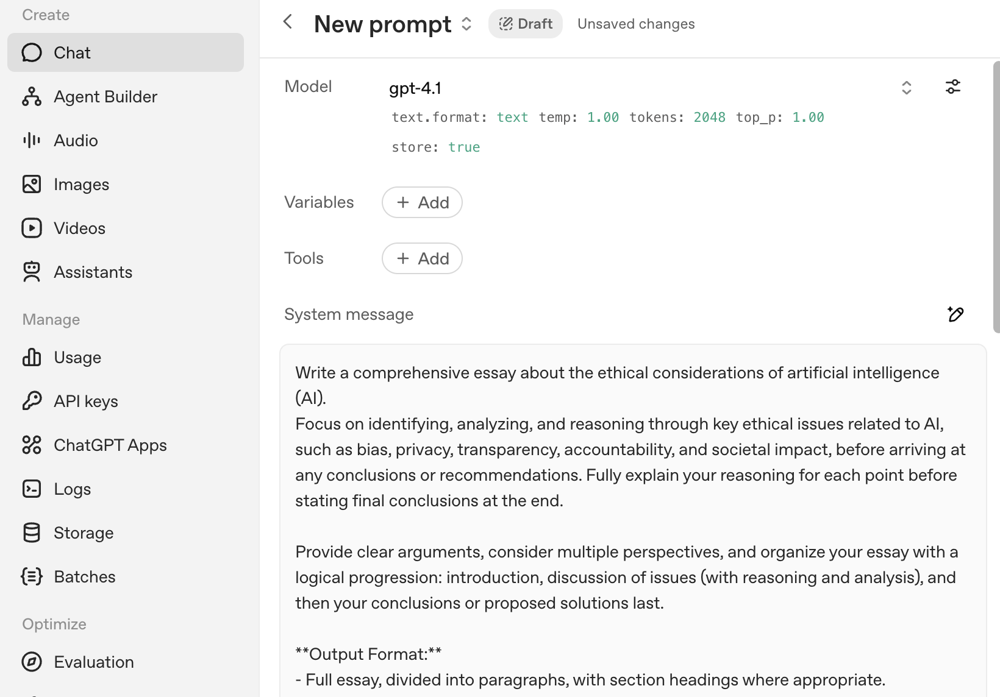

# Prompt Engineering Lab  
**LLMs and ChatGPT | Spring 2026**  

## Overview

This lab introduces foundational ideas in prompt engineering and uses them to explore a central question for modern AI systems and agentic workflows:

> **What is the relationship between zero-shot prompting, chain-of-thought prompting, and model-side reasoning?**

You will work hands-on with the OpenAI Platform Chat interface to compare how the *same task* behaves under different prompting styles and system settings. Rather than treating prompting as a bag of tricks, this lab emphasizes conceptual understanding: what changes when you add structure versus when the model reasons more internally.

This lab is exploratory rather than prescriptive. There is no single “correct” output. Your goal is to observe patterns, articulate differences, and reflect on how these mechanisms matter for agent design.

---

## Learning Objectives

By the end of this lab, you should be able to:

- Distinguish between **zero-shot**, **few-shot**, and **chain-of-thought-style** prompting
- Explain how **prompt structure** differs from **model-side reasoning effort**
- Use the Platform Chat interface intentionally
- Describe when improvements come from clearer instructions versus increased reasoning
- Connect prompting techniques to early ideas in **agentic AI workflows**

---

## Background: Prompting, Reasoning, and Agents

Large Language Models (LLMs) such as ChatGPT are typically **instruction-tuned**, meaning they are trained to follow user instructions expressed in natural language. Early interactions with these models often relied on *simple prompts*: a single question or instruction, with no examples and no explicit reasoning steps.

Beginning around 2024, models were increasingly tuned for **reasoning**. In this context, *reasoning* means that the model is optimized to internally decompose complex tasks into intermediate steps before producing a final answer.

This lab focuses on how that shift interacts with **prompting strategies**:

- What happens when you provide *no* reasoning structure?
- What happens when you provide *explicit* reasoning structure?
- What happens when the *model itself* is given more reasoning budget?

Understanding these differences is essential for working with **agents**, where models must plan, decide, act, and evaluate—often repeatedly.

---

## Prompting Types

You will encounter (and compare) the following prompting styles:

- **Zero-shot prompting**  
  Asking the model to perform a task without providing examples or a reasoning process.

- **Few-shot prompting**  
  Providing a small number of examples that demonstrate the task before asking the model to perform it.

- **Chain-of-thought-style prompting**  
  Asking the model to articulate an approach or intermediate reasoning steps before producing a final answer.

> Important note: In this lab, “chain of thought” refers to **prompt-visible structure**, not the model’s private internal reasoning.

---

## Core Prompting Principles

As you work through the lab, keep these principles in mind. You will see them echoed in the Platform’s prompt optimizer.

### Be specific  
Ambiguity is almost always interpreted *against* you. Specify:
- The task
- The audience
- The length
- The tone
- Any required components

### Specify the output  
Tell the model *exactly* what the final artifact should look like:
- Paragraph vs. bullets
- Headings or sections
- Required points
- Ordering constraints

### Request *for*, not *against*  
Use affirmative instructions:
- “Write in an academic tone”  
  rather than  
- “Don’t write casually”

### Use “act as if” framing  
Assigning a role can anchor the model’s assumptions and vocabulary.

Example:
> “You are an expert in AI ethics teaching a graduate seminar.”

### Use delimiters  
Structure your prompt visually and logically using markers like:
- `### Instructions`
- `### Context`
- `### Output format`

This reduces confusion and improves consistency.

---

## Tools You Will Use

You may complete this lab using either ChatGPT or Claude. The instructions below assume **ChatGPT**, because I feel that the Platform interface makes system controls more explicit.

### Interfaces

- **ChatGPT (consumer interface)**  
  https://chat.openai.com  
  Useful for quick experimentation, but limited visibility into system controls.

- **OpenAI Platform Chat interface**  
  https://platform.openai.com/chat  
  Allows you to:
  - Select models
  - Adjust reasoning effort
  - Inspect optimized prompts
  - Compare runs more systematically

You will use the **Platform Chat interface** for this lab.

---

## Part 1: Define Your Task (Offline)

Before opening any interface, decide what task you want the model to perform.

### Instructions

Write a short description that answers:

- What do you want the model to do?
- Who is the audience?
- How long should the output be?
- What must it include?

Keep the task **small and readable**. You will be comparing multiple outputs side by side.

### If you need an example task

If you are unsure what to choose, use this:

> Write an essay on the ethics of AI agents. (select your oen audience, tone, position, and length)

### Constraints for this lab

- Use natural language tasks
- Do not use coding prompts
- Do not use multi-document analysis

The goal is to focus on reasoning and structure, not technical syntax.

### Steps

1. Navigate to the consumer-facing [ChatGPT interface](https://chatgpt.com/). Note the model in the upper left corner.
2. Input your prompt and take note of the output.
3. Make suggestions and modifications until you are satisfied with the output. (keep track of the feedback you give the model)

---

## Part 2: The Platform Chat Interface

In this section, you will run your task through the OpenAI Platform Chat interface and observe how the system treats your prompt. It will turn your message into a 'system message'. 

### Steps

1. Navigate to the [Platform Chat interface:](https://platform.openai.com/chat)

2. Describe your task (or paste the same prompt) into the box below Create a Chat Prompt. 

3. Review the optimized prompt in the 'System Message' field (more on message types below). Use the magic pencil if you want to make any changes. 

### Reflection questions

After the response, write brief notes addressing:

- How is the optimized prompt structured?
- What information was added?
- Was anything removed or reframed?
- Does the structure suggest chain-of-thought-style reasoning?
- How does this differ from how you originally phrased the task?

These notes will feed directly into your final report.

---
## Part 3: System Messages, User Messages, and Prompt Messages

Modern chat-based LLM interfaces are built on conversations. These are sequences of structured messages with roles. Understanding these message types is essential to control how an LLM interprets your task.

Each message in a conversation has a role:

| Role | What it represents | Purpose |
|------|------------------|---------|
| **System** (or Developer) | Instructions to the model about overall behavior | Guides the model’s role, assumptions, tone, output format, and constraints |
| **User** | The user’s actual prompt or task | Contains the specific question, task, data, or examples you want the model to work with |
| **Assistant** | The model’s previous response | Includes prior outputs if you’re continuing a conversation |

### How these roles influence the model

1. **System Messages**
   - The highest-priority instructions the model sees.  
   - They influence every user prompt that follows.  
   - Typical use:
     - “You are a helpful expert in X”
     - “Always output JSON with the following fields”
     - “Write in an academic tone”
     - Here's a detailed set of instructions about what I'm trying to accomplish.
   - *System messages shape the context and guardrails for the model. 

2. **User Messages**
   - These are the actual task description, data, and examples you want solved.
   - They are more specific than system instructions.
   - Think of them as the *question you ask*, whereas the system is the *role and rules you set first.*

3. **Prompt Messages**
   - In the Platform Chat UI, the term “prompt” usually refers to what the user types.
   - But from a technical view, the *full prompt* is the entire message array: **system + user + any previous assistant messages**.
   - When doing prompt engineering, we deliberately split high-level guidance (system) from task details (user) to see which influences output most.

## Why This Matters for Agents

An agentic system typically separates functions in a way that mirrors these roles:

- **System messages** act like an agent’s *constitution or policy*  
  - What the agent is allowed to do  
  - What goals it serves  
  - What rules it must follow  

- **User messages** act like *tasks or goals* given to the agent  
  - What problem to solve  
  - What decision to make  
  - What output to produce  

- **Assistant messages** represent the agent’s *state over time*  
  - Previous reasoning  
  - Past actions  
  - Intermediate results  

When an agent plans, acts, evaluates, and loops, it is effectively:
- Operating under persistent system-level constraints
- Responding to changing user-level goals
- Using its own prior outputs as context for future decisions

In other words:
> **Prompt roles are a simplified version of agent architecture.**

This distinction becomes critical as systems move from single-turn prompts to multi-step, agentic workflows.
---

## Part 4: Experimenting with Model Controls and Temperature

In the Platform interface, you will see:
- A way to select a model (e.g., “GPT-4.1”, “o3”, “o1-series”)
- Parameters
    - With traditional models: A temperature slider and a Top-p control for randomness and creativity
    - With reasoning: Reasoning effort
- An Evaluate button where you can generate multiple outputs for comparison

#### Model Selection
Different models behave differently:
- Reasoning-oriented models (like o1, o3) may reason internally and handle structured tasks better
- ChatGPT models (like GPT-4.1) may be more balanced for general instruction tasks

#### To Do 
Select two different models and run the *same prompt* through each to compare:
- Output quality
- Fidelity to constraints (format, length, content)
- Erroneous or hallucinated information

Record observations.

#### Temperature
- **Low temperature (e.g., 0.0–0.2)** → more deterministic, focused, factual outputs  
- **Higher temperature (e.g., 0.7–1.0)** → more creative, varied outputs  
You can adjust this via the UI slider before running the prompt.

**To Do**
- Run each prompt with **temperature = 0.1** and **temperature = 1.2**
- Compare:
  - Does the model stay on topic more with low temperature?
  - Does it introduce imaginative or wrong answers with higher temperature?

---

## Part 5: Evaluate and Compare Outputs

Take a moment to note the difference between changing the model and changing the temperature/top P, keeping in mind that changing the model changes the structure and training of the model itself. Changing the parameters (temperature/top P) just modifies the output by adjusting the probability of the next word.

Reasoning models are fine tuned for reasoning tasks. Reasoning models are key to effective agents.

---

## Part 6 OPTIONAL: Structured Prompt Variants

You will now evolve one prompt through three variants (this is very relevant to effectively using LLMs, not directly relevant to Agents):

### 1) System-Heavy Prompt
- Put *as much guidance as possible* into the **System / Developer Message**
- Keep the user message short (e.g., “Write a 200-word paragraph on X”)

**Purpose**
Test whether *changing the role context* shifts the model’s behavior without altering the user content.

### 2) User-Heavy Prompt
- Put *most guidance in the user message*
- Keep the system message minimal (e.g., just “You are an expert assistant”)

**Purpose**
Test whether task details matter more when placed in lower-priority positions.

### 3) Split Prompt (System + User)
- Place high-level rules in the System
- Place task details in User

**Purpose**
This is often best practice: general rules in System, specifics in User.

Compare these three across:
- Models
- Temperature settings
- Evaluate runs

---

## Part 7: Reasoning Effort vs. Prompt Engineering

**To Do:**

Use your best performing prompt, select a reasoning model, and run it with:
- **Low reasoning effort**
- **High reasoning effort**

Keep everything else constant.

Write a short comparison answering:
- Did reasoning effort improve accuracy?
- Did improved prompt structure reduce dependency on heavy reasoning?
- Which combination was most reliable for your task?

This part connects **system message design** with **model-internal reasoning**—a key distinction in agentic AI.

---

## Part 8: Submission

Have an LLM convert your notes into a User Feedback Report. Email it to me at:

michellamcsweeney@gmail.com

### Sections to include
1) Task description  
2) System vs User prompt versions  
3) Evaluation settings used (model, temperature, reasoning effort)  
4) Results summary (Compare outputs)  
5) Reflections on:
   - System vs User messages
   - Model differences
   - Temperature effects
6) Final conclusions  

