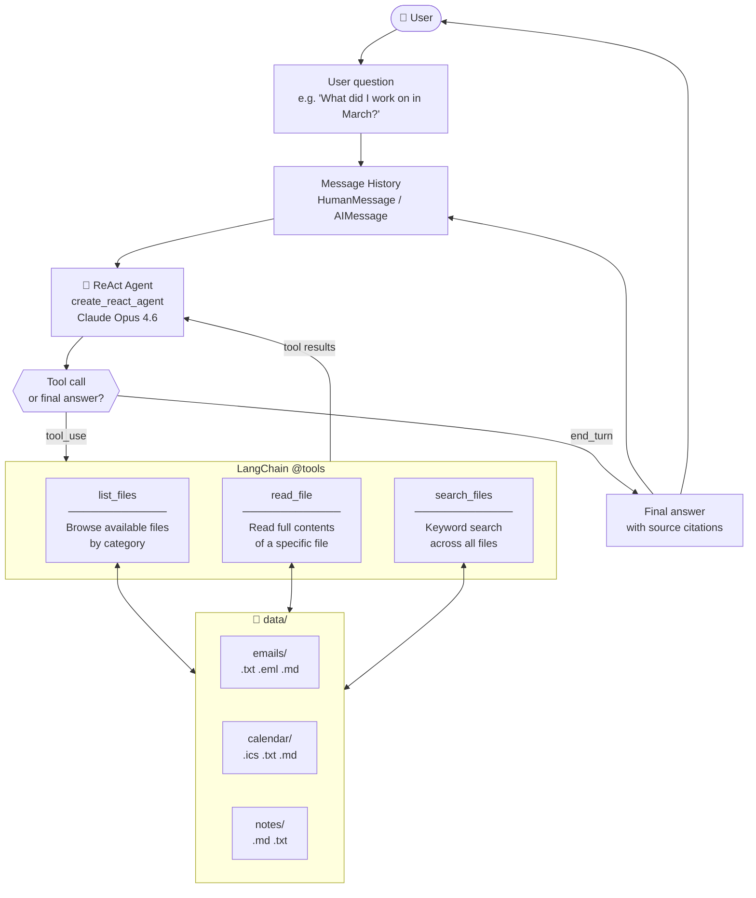

# What Did I Work On? — Agent Architecture

```mermaid
flowchart TD
    User(["👤 User"])
    Input["User question\ne.g. 'What did I work on in March?'"]
    History["Message History\nHumanMessage / AIMessage"]
    Agent["🤖 ReAct Agent\ncreate_react_agent\nClaude Opus 4.6"]
    Decision{{"Tool call\nor final answer?"}}
    Answer["Final answer\nwith source citations"]

    subgraph Tools["LangChain @tools"]
        T1["list_files\n─────────────\nBrowse available files\nby category"]
        T2["read_file\n─────────────\nRead full contents\nof a specific file"]
        T3["search_files\n─────────────\nKeyword search\nacross all files"]
    end

    subgraph DataDir["📁 data/"]
        E["emails/\n.txt .eml .md"]
        C["calendar/\n.ics .txt .md"]
        N["notes/\n.md .txt"]
    end

    User --> Input
    Input --> History
    History --> Agent
    Agent --> Decision

    Decision -- "tool_use" --> Tools
    T1 & T2 & T3 <--> DataDir
    Tools -- "tool results" --> Agent

    Decision -- "end_turn" --> Answer
    Answer --> History
    Answer --> User
```
